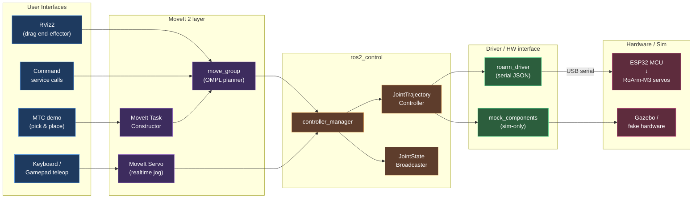

# robot_eblan

A patched ROS 2 workspace that revives Waveshare's legacy **RoArm simulation + MoveIt 2** pipeline on modern systems — specifically **Ubuntu 24.04** with ROS 2 **Humble** *or* **Jazzy**.

> TL;DR — Waveshare's `roarm_ws` only ships supported on Ubuntu 22.04 / Humble. This repo is the minimum delta to make the same RViz drag-and-drop, MoveIt servo, command control, and MTC demos build and run on 24.04, without re-architecting any of the original logic.

---

## Why this exists

Waveshare distributes the RoArm-M3 ROS 2 stack as a VirtualBox image pinned to **Ubuntu 22.04 + ROS 2 Humble**. If you're on a fresh 24.04 install — or you'd rather not run a 12 GB VM just to talk to a serial port — the upstream packages don't build out of the box:

- **No Humble binaries for 24.04.** `apt install ros-humble-*` fails on Noble; everything has to come from source or be migrated to Jazzy's package set.
- **MoveIt 2 / `ros2_control` API drift** between Humble and Jazzy (planning scene monitor, controller manager, servo node config, parameter declarations).
- **Stale CMake / xacro.** A few of Waveshare's `CMakeLists.txt` pin deprecated headers or transitively pull simulation packages that were removed/renamed on 24.04. Jazzy's xacro is also stricter about macro arguments.
- **`gz` vs `ignition` migration.** Sim launch files reference packages under names that no longer exist.

The goal here is **not** a rewrite. It's the smallest patch set that gets the original Waveshare tutorial flow (drive node → MoveIt drag → servo → command → MTC) working natively on 24.04.

---

## Architecture



**Flow.** User input enters at the top (RViz interactive marker, teleop, service call, or MTC demo). MoveIt 2 plans a trajectory, hands it to `ros2_control`, which streams joint commands either to `roarm_driver` (real arm, JSON over USB serial to the ESP32) or to `mock_components` / Gazebo for simulation. `JointStateBroadcaster` closes the loop back to RViz and MoveIt.

---

## Repository layout

```
robot_eblan/
├── src/                  ← packages (the only thing you need to read)
├── build/                ← colcon build artifacts (gitignored on a clean clone)
├── install/              ← colcon install space
└── log/                  ← colcon logs
```

The workspace is a standard `colcon` layout. Only `src/` is meant to be edited; `build/`, `install/`, `log/` are regenerated by `colcon build`.

> **Note:** the package list under `src/` mirrors Waveshare's `roarm_ws` (typically `roarm_description`, `roarm_moveit`, `roarm_moveit_cmd`, `roarm_moveit_servo`, `roarm_moveit_mtc_demo`, `roarm_driver`). Patches relative to upstream are tracked per-package — see commit history for the specific 24.04 fixes.

---

## Compatibility matrix

| Host OS         | ROS 2 distro | Status            | Notes                                     |
| --------------- | ------------ | ----------------- | ----------------------------------------- |
| Ubuntu 22.04    | Humble       | ✅ upstream baseline | Waveshare default, unchanged              |
| Ubuntu 24.04    | Humble       | ⚠️ source build only | Requires building Humble from source      |
| Ubuntu 24.04    | Jazzy        | ✅ target of this fork | Use `apt` binaries; primary supported path |

---

## Build

```bash
# Prereqs (Jazzy on Ubuntu 24.04)
sudo apt update
sudo apt install -y \
    ros-jazzy-desktop \
    ros-jazzy-moveit \
    ros-jazzy-moveit-servo \
    ros-jazzy-moveit-task-constructor \
    ros-jazzy-ros2-control \
    ros-jazzy-ros2-controllers \
    python3-colcon-common-extensions

# Clone & build
git clone https://github.com/vyacheslav1911-x/robot_eblan.git
cd robot_eblan
rm -rf build install log          # always wipe before a fresh build
source /opt/ros/jazzy/setup.bash
rosdep install --from-paths src --ignore-src -r -y
colcon build --symlink-install
source install/setup.bash
```

For Humble on 24.04, replace `jazzy` with `humble` and source your local Humble build instead of `/opt/ros/...`.

---

## Run

The flow matches the original Waveshare tutorial — only the distro changes.

```bash
# Terminal 1 — driver (real arm only; skip for sim)
ros2 launch roarm_driver roarm_driver.launch.py

# Terminal 2 — pick one:

# (a) RViz drag-and-drop
ros2 launch roarm_moveit demo.launch.py

# (b) Keyboard / gamepad servo
ros2 launch roarm_moveit_servo servo_control.launch.py

# (c) Service-based command control
ros2 launch roarm_moveit_cmd command_control.launch.py

# (d) MoveIt Task Constructor demo
ros2 launch roarm_moveit_mtc_demo mtc_demo.launch.py
```

If RViz comes up empty, set **Fixed Frame** to `base_link` and add a `MotionPlanning` display — same as the upstream guide.

---

## What's actually patched

High-level summary of the kinds of changes in this fork (see commit history for specifics):

- `package.xml` / `CMakeLists.txt` updated for Jazzy package names and removed deprecated deps.
- MoveIt config regenerated against the Jazzy `moveit_setup_assistant` schema.
- `ros2_control` controller YAML migrated to the current parameter format.
- Servo node config updated for the post-Humble `moveit_servo` API.
- xacro files cleaned up to satisfy stricter parsing.
- Sim launch files repointed from `ignition` → `gz` package names.

---

## Status

This is a **work in progress**. The intent is parity with the Waveshare tutorial, not new features. Issues and PRs welcome — especially for distros / driver paths I haven't tested yet.

---

## Credits

- Hardware and original `roarm_ws` ROS 2 stack: [Waveshare](https://github.com/waveshareteam/roarm_ws)
- 24.04 / Jazzy port: this repo
